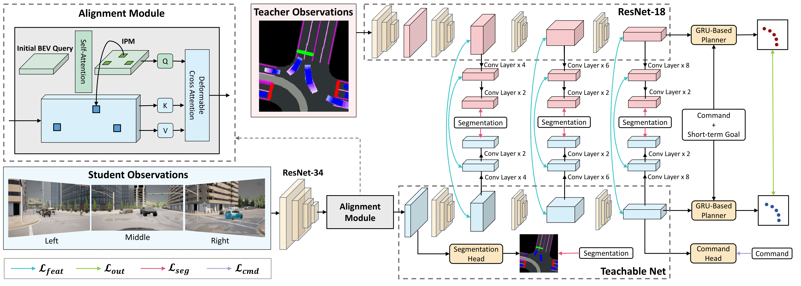

# CaT: Coaching a Teachable Student



> [**Coaching a Teachable Student**](https://catdrive.github.io/)    
> Jimuyang Zhang, Zanming Huang, Eshed Ohn-Bar   
> _CVPR 2023_

## Introduction

This repository contains the code for **CaT: Coaching a Teachable Student**. 

CaT is a deep knowledge distillation framework for effectively teaching a student agent to drive from the supervision of a privileged teacher agent.


## TODO List (comming soon)
- [ ] Data collection Code
- [ ] Training Code
- [x] Teacher Evaluation Code
- [x] Student Evaluation Code
- [x] Teacher Model Checkpoint
- [x] Student Model Checkpoint

## Getting Started
- Please follow [Installation](./docs/INSTALL.md) to get started.


## Evaluation
To run evaluation, first start the CARLA server

```
cd CARLA_ROOT
./CarlaUE4.sh
```
### Student Evaluation
Make sure all environment varibles are setup correctly.then run

```
ROUTES=[Path to Route File] bash ./leaderboard/scripts/run_evaluation.sh
```

where `ROUTES` points to a route `xml` file (e.g. `leaderboard/data/routes_devtest.xml`) . 

### Teacher Evaluation

To evaluate teacher model on the Longest6 benchmark, run the following after changing the environment varibles accordinly in the script

```
bash ./leaderboard/scripts/local_evaluation.sh
```
The teacher model checkpoint can be found [here](https://drive.google.com/drive/folders/1F3uUNN0EsGQv1-FVqccBKNa6-mT0lJ3L?usp=drive_link)

## Citation
If you find this repo useful, please cite

```
@inproceedings{zhang2023coaching,
        title={Coaching a Teachable Student},
        author={Zhang, Jimuyang and Huang, Zanming and Ohn-Bar, Eshed},
        booktitle={CVPR},
        year={2023}
}
```

## Acknowledgements

Our code references the following repositories:
- [CARLA Leaderboard](https://github.com/carla-simulator/leaderboard)
- [Scenario Runner](https://github.com/carla-simulator/scenario_runner)
- [Persformer](https://github.com/OpenDriveLab/PersFormer_3DLane)
- [LAV](https://github.com/dotchen/LAV/)
